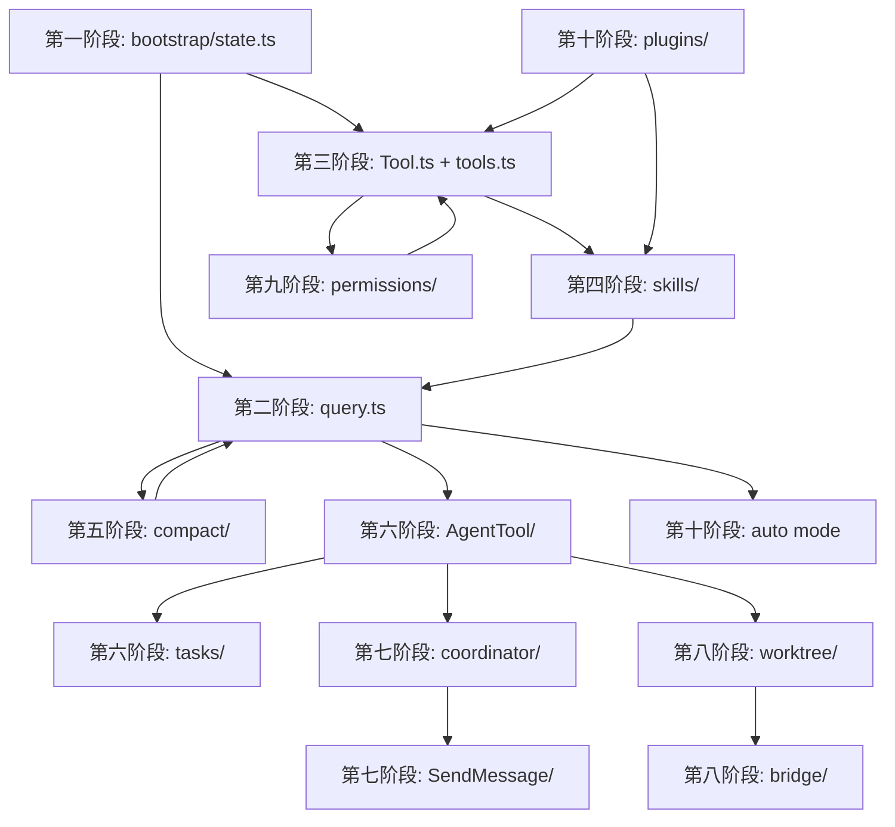

# Claude Code 源码阅读路线图

## 总体概览

本仓库是 Claude Code CLI 的完整实现（TypeScript + React/Ink 终端 UI），约 30 万行。阅读路径按**从启动 → 核心循环 → 由简到繁的子系统**的依赖顺序编排。

---

## 附录 A: 模块依赖关系图



## 附录 B: 关键设计模式

1. **工具注册表** (`src/tools.ts`) — 所有工具通过 Map 注册，按 name 查找
2. **依赖注入** (`src/query/deps.ts`) — query() 通过参数注入 CanUseTool、findToolByName
3. **全局单例状态** (`src/bootstrap/state.ts`) — 模块级 STATE 对象，避免循环依赖
4. **分阶段 context 构建** (`src/context.ts`) — system prompt 由多个 section 组装
5. **工厂模式** (`src/tools/AgentTool/runAgent.ts`) — runAgent() 是子 agent 的工厂函数
6. **观察者模式** — `createSignal()` 用于跨模块通知
7. **策略模式** (compact) — 多种压缩策略按条件选择
8. **权限链** (permissions) — 多层权限检查形成责任链

## 附录 C: 自建实现路线

```
1. CLI + Config (~500行)         → 能启动、读取配置、连接 API
2. 简单 query loop (~800行)      → 用户输入 → API → 流式输出 → 文本显示
3. 3 个基础工具 (~600行)         → Read + Write + Bash
4. 权限确认 (~400行)             → 每个工具调用前请求用户确认
5. skill 加载 (~400行)           → 扫描目录 → 解析 SKILL.md → 注入 system prompt
6. 上下文压缩 (~500行)           → token 超限 → 摘要 → 替换
7. 子 agent (~600行)             → AgentTool → 独立会话 → 返回结果
8. 任务图 (~500行)               → TaskCreate → 依赖 → 并行执行
9. 团队邮箱 (~400行)             → SendMessage → 消息队列 → 多 agent 协作
10. worktree 隔离 (~600行)       → EnterWorktree → git worktree → 独立进程
─────────────────────────────────────────────
总计: ~5500 行核心逻辑（不含 UI）
```

---

## 第一阶段：启动引导 & 全局状态
**目标：理解进程如何启动、全局状态如何管理**

| # | 文件 | 说明 |
|----|------|------|
| 1.1 | `src/main.tsx` | **主入口**。CLI 参数解析（commander）、OAuth/API Key 认证、GrowthBook 特性开关、启动 profile |
| 1.2 | `src/bootstrap/state.ts` | **全局状态中心**。sessionId、totalCostUSD、mainLoopModel、invokedSkills、agentColorMap...所有跨模块共享的状态存于此 |
| 1.3 | `src/entrypoints/init.ts` | SDK/CLI 双入口初始化：settings 分层解析（userSettings → projectSettings → localSettings → flagSettings → policySettings） |
| 1.4 | `src/context.ts` | **系统上下文构建**。`getSystemContext()` 生成发给模型的 system prompt——理解 Claude Code 提示词工程的入口 |
| 1.5 | `src/utils/config.ts` | 配置读写（globalConfig / projectConfig / localConfig），设置分层优先级 |
| 1.6 | `src/utils/settings/` | Settings 完整实现：分层读取、缓存、变更检测 |

---

## 第二阶段：Agent Loop（核心查询循环）
**目标：理解一次用户输入到模型回复的完整链路**

| # | 文件 | 说明 |
|----|------|------|
| 2.1 | `src/query.ts` | **核心循环**。`query()` 是 agent loop 引擎：组装 messages → 调用 API → 流式解析 → 处理 tool_use → 执行工具 → 将结果注入下一轮 |
| 2.2 | `src/QueryEngine.ts` | **会话级编排器**（1295 行）。包装 `query()`：管理 session 生命周期、权限回放、SDK 消息重放、记忆加载、用量追踪。是从「单次 query」到「完整 session」的关键桥梁 |
| 2.3 | `src/query/transitions.ts` | 模式状态机：plan / auto / default 切换、权限变更、compaction 触发 |
| 2.4 | `src/query/tokenBudget.ts` | Token 预算管理：output token 计数、budget continuation、warning |
| 2.5 | `src/query/deps.ts` | 依赖注入接口：CanUseTool、findToolByName 等函数签名 |
| 2.6 | `src/services/api/` | Anthropic API 客户端：消息流式请求、重试、错误处理、速率限制 |
| 2.7 | `src/constants/prompts.ts` | **系统提示词**。DEFAULT_AGENT_PROMPT 定义核心行为契约——工具选择、安全边界 |
| 2.8 | `src/types/message.ts` | 消息类型系统：AssistantMessage、UserMessage、ToolUse、ToolResult 等定义 |

---

## 第三阶段：工具系统
**目标：理解工具的定义、注册、调度、权限、渲染全流程**

| # | 文件 | 说明 |
|----|------|------|
| 3.1 | `src/Tool.ts` | **工具基类**：name、description、inputSchema、prompt、`call()`、权限检查、渲染方法 |
| 3.2 | `src/tools.ts` | **工具注册表**。`getTools()` 返回所有工具的 Map，按平台/功能动态组装 |
| 3.3 | `src/tools/BashTool/BashTool.ts` | 最复杂的工具：沙箱执行、进程管理、输出截断、PTY |
| 3.4 | `src/tools/FileReadTool/` | 文件读取：分页、图片/PDF、缓存 |
| 3.5 | `src/tools/FileEditTool/` | 精确字符串替换、diff 生成 |
| 3.6 | `src/tools/FileWriteTool/` | 覆盖写、新文件创建 |
| 3.7 | `src/tools/GlobTool/` + `src/tools/GrepTool/` | 文件搜索 & 内容搜索 |
| 3.8 | `src/tools/WebFetchTool/` + `src/tools/WebSearchTool/` | 网络抓取 & 网络搜索 |
| 3.9 | `src/tools/PowerShellTool/` | Windows PowerShell（平台特化） |
| 3.10 | `src/tools/MCPTool/` | MCP 协议工具代理（将外部 MCP server 的工具映射为本地 tool） |

> 后续阶段的 AgentTool、SkillTool、TaskCreateTool、SendMessageTool 等也都是工具，在各自阶段详述。

---

## 第四阶段：按需 Skill 加载
**目标：理解 skill 的发现、加载、注入全流程**

| # | 文件 | 说明 |
|----|------|------|
| 4.1 | `src/skills/loadSkillsDir.ts` | **Skill 扫描器**。递归扫描 `.claude/skills/` 和全局 skills 目录，解析 SKILL.md frontmatter |
| 4.2 | `src/skills/bundledSkills.ts` | 内置 skill 注册 |
| 4.3 | `src/tools/SkillTool/` | SkillTool：模型调用 skill 时触发，找到 skill → 注入上下文 |
| 4.4 | `src/tools/DiscoverSkillsTool/` | 允许模型发现可用 skills |
| 4.5 | `src/commands.ts` | **命令注册表**。`/command` 系统——slash command 作为一种特殊的 skill 入口 |
| 4.6 | `src/skills/mcpSkills.ts` | MCP 驱动的动态 skills（MCP server tool → skill 转换） |

**三层架构**：`用户输入` → `commands.ts`(/command) → `SkillTool`(SKILL.md) → `MCP`(动态 skills)

---

## 第五阶段：上下文压缩
**目标：理解超长对话如何被压缩，避免超出 token 限制**

| # | 文件 | 说明 |
|----|------|------|
| 5.1 | `src/services/compact/compact.ts` | **核心压缩引擎**。`buildPostCompactMessages()`：将历史总结为结构化摘要 |
| 5.2 | `src/services/compact/autoCompact.ts` | 自动压缩决策：token 阈值检测、触发时机 |
| 5.3 | `src/services/compact/microCompact.ts` | 微压缩策略（轻量级，压缩少量消息） |
| 5.4 | `src/services/compact/snipCompact.ts` + `snipProjection.ts` | 裁剪压缩：安全地"剪掉"旧消息 |
| 5.5 | `src/services/compact/prompt.ts` | 压缩用提示词——告诉模型如何生成摘要 |
| 5.6 | `src/services/compact/grouping.ts` | 消息分组：连续的 tool_use + tool_result 合并为一个逻辑单元 |
| 5.7 | `src/services/contextCollapse/` | 上下文折叠（将中间 tool 调用折叠为摘要） |

> 其余文件（`cachedMCConfig`、`timeBasedMCConfig`、`compactWarning*`、`postCompactCleanup`、`sessionMemoryCompact`）是辅助配置/清理/钩子，通读核心 7 个后按需翻阅即可。

---

## 第六阶段：子 Agent 派生 & 任务系统
**目标：理解 AgentTool fork 子会话 + 任务依赖图**

### 6A: 子 Agent 派生（核心 6 文件）

| # | 文件 | 说明 |
|----|------|------|
| 6A.1 | `src/tools/AgentTool/AgentTool.tsx` | 工具定义、参数 schema、UI 渲染 |
| 6A.2 | `src/tools/AgentTool/runAgent.ts` | **子 Agent 引擎**。创建子会话 → 注入 agent 专用 system prompt → 调用 query() 循环 → 收集并返回摘要 |
| 6A.3 | `src/tools/AgentTool/prompt.ts` | Agent system prompt 构建：角色、工具集、输出格式 |
| 6A.4 | `src/tools/AgentTool/forkSubagent.ts` | Fork 逻辑：上下文继承、模型选择、独立 color 分配 |
| 6A.5 | `src/tools/AgentTool/builtInAgents.ts` + `built-in/` | 内置 agent 类型：plan-mode agent、review agent 等 |
| 6A.6 | `src/utils/forkedAgent.ts` | Forked agent 上下文工具：createSubagentContext |

> 其余（agentColorManager、agentDisplay、agentMemory、resumeAgent、loadAgentsDir、UI、buddy/）是 UI/配置/恢复辅助，核心知道后按需翻阅。

### 6B: 任务系统（核心 7 文件）

| # | 文件 | 说明 |
|----|------|------|
| 6B.1 | `src/tasks/types.ts` | TaskState、TaskStatus、依赖关系 |
| 6B.2 | `src/Task.ts` | Task 基类 |
| 6B.3 | `src/tasks/LocalAgentTask/` | **核心任务**。由 TaskCreateTool 创建的实际执行单元，完整的生命周期管理 |
| 6B.4 | `src/tasks/LocalShellTask/` | 后台 shell 进程任务 |
| 6B.5 | `src/tools/TaskCreateTool/` + `TaskListTool/` + `TaskUpdateTool/` | Task 工具链：创建 / 列出 / 更新 / 停止 |
| 6B.6 | `src/tasks.ts` | 任务注册与管理 |
| 6B.7 | `src/hooks/useTasksV2.ts` | V2 任务系统核心钩子 |

> 其余 Task 类型（LocalWorkflowTask、InProcessTeammateTask、RemoteAgentTask、DreamTask、MonitorMcpTask）及 UI 组件，在核心理解后按需翻阅。

---

## 第七阶段：异步邮箱 & 团队协调
**目标：理解多 Agent 之间的消息传递和协调**

| # | 文件 | 说明 |
|----|------|------|
| 7.1 | `src/coordinator/coordinatorMode.ts` | **协调者模式**。任务分发、结果汇总、冲突调解 |
| 7.2 | `src/tools/TeamCreateTool/TeamCreateTool.ts` | TeamCreate：创建命名团队，定义成员 agent |
| 7.3 | `src/tools/SendMessageTool/SendMessageTool.ts` | **异步邮箱**。agent 间消息传递，支持等待回复、消息队列 |
| 7.4 | `src/context/mailbox.tsx` | 邮箱 React Context |
| 7.5 | `src/hooks/useMailboxBridge.ts` | 邮箱 ↔ UI 桥接 |
| 7.6 | `src/hooks/useSwarmInitialization.ts` | Swarm 批量 agent 启动 |

---

## 第八阶段：Worktree 隔离 & 并行执行
**目标：理解 git worktree 如何为 agent 提供隔离执行环境**

| # | 文件 | 说明 |
|----|------|------|
| 8.1 | `src/tools/EnterWorktreeTool/` | 创建 git worktree → checkout 分支 → 在隔离环境执行 |
| 8.2 | `src/tools/ExitWorktreeTool/` | 合并分支 → 清理 worktree → 返回主 tree |
| 8.3 | `src/bridge/sessionRunner.ts` | **会话生成器**。SessionSpawner：spawn 子进程——每个 agent/worktree 运行在独立 CLI 进程中 |
| 8.4 | `src/bridge/bridgeMain.ts` | Bridge 主逻辑：进程间通信、permission 转发、session 生命周期 |
| 8.5 | `src/bridge/types.ts` | Bridge 类型：SessionHandle、SessionSpawner、SessionActivity |
| 8.6 | `src/bridge/createSession.ts` + `peerSessions.ts` | 子会话创建 & 对等会话管理 |

> 其余 bridge 文件（envLessBridgeConfig、capacityWake、bridgeApi、bridgeConfig、bridgeEnabled、codeSessionApi、replBridge、webhookSanitizer）是具体配置/辅助，通读核心 6 个后按需翻阅。

---

## 第九阶段：权限治理
**目标：理解多层权限模型**

| # | 文件 | 说明 |
|----|------|------|
| 9.1 | `src/hooks/useCanUseTool.tsx` | **核心权限入口**。检查规则链：配置规则 → session mode → plan 约束 → 用户确认 |
| 9.2 | `src/hooks/toolPermission/PermissionContext.ts` | 权限上下文：当前 session 模式（default / acceptEdits / bypassPermissions / plan / dontAsk） |
| 9.3 | `src/components/permissions/PermissionDialog.tsx` + `PermissionRequest.tsx` | 权限对话框 & 通用请求组件 |
| 9.4 | `src/components/permissions/rules/` | **权限规则引擎**。用户可配置的持久化规则（如"总是允许 Bash 读取"） |
| 9.5 | `src/components/permissions/BashPermissionRequest/` | Bash 工具权限——最复杂：路径白名单、命令黑名单、沙箱 |
| 9.6 | `src/components/permissions/FileEditPermissionRequest/` + `FileWritePermissionRequest/` + `FilesystemPermissionRequest/` | 文件操作权限组 |
| 9.7 | `src/services/policyLimits/` | 组织级策略限制（硬约束，不可覆盖） |
| 9.8 | `src/services/remoteManagedSettings/` | IT 管理员远程推送的权限策略 |

**5 层权限链**：`policyLimits` → `remoteManagedSettings` → `permissions/rules/` → `PermissionContext`(session mode) → `PermissionDialog`(实时确认)

---

## 第十阶段：高级特性 & 横向模块

### 10A: Plugin 系统
**扩展 Claude Code 的官方机制**

| 文件 | 说明 |
|------|------|
| `src/plugins/builtinPlugins.ts` | 内置插件注册 |
| `src/plugins/bundled/` | 捆绑插件（hooks、commands、agents 的插件化包装） |
| `src/services/plugins/` | 插件生命周期管理：安装、启用、更新 |
| `src/utils/settings/types.ts` | PluginHookMatcher——理解 plugin hook 如何与 settings 集成 |

### 10B: Auto Mode / Classifier 系统
**AI "放手"自动执行时，如何决定跳过权限确认**

| 文件 | 说明 |
|------|------|
| `src/query/transitions.ts` | auto mode 的进出逻辑 |
| `src/services/compact/autoCompact.ts` | auto mode 下自动触发 compaction |
| （classifier 逻辑嵌入在 `src/query.ts` + `src/services/api/` 中） | YOLO 分类器：模型输出前判断当前操作是否安全 |

### 10C: UI 架构 (React + Ink)

| 文件 | 说明 |
|------|------|
| `src/components/App.tsx` | Ink 渲染根组件 |
| `src/ink.ts` / `src/ink/` | Ink 封装 |
| `src/components/Messages.tsx` | 虚拟滚动消息列表 |
| `src/components/PromptInput/` | 输入框（自动补全、历史搜索） |
| `src/components/StatusLine.tsx` | 状态栏 |
| `src/state/AppState.tsx` + `store.ts` | Zustand 状态管理 |

### 10D: MCP 集成

| 文件 | 说明 |
|------|------|
| `src/services/mcp/` | MCP 客户端/服务端 |
| `src/tools/MCPTool/` + `ListMcpResourcesTool/` + `ReadMcpResourceTool/` | MCP 工具代理 |
| `src/components/mcp/` | MCP UI |

### 10E: Hook 系统（生命周期钩子）

| 文件 | 说明 |
|------|------|
| `src/utils/hooks/` | SessionStart / PostToolUse / PreToolUse / SessionEnd 等生命周期 hook |
| `src/utils/hooks/registerFrontmatterHooks.ts` | 从 SKILL.md frontmatter 注册 hooks |
| `src/utils/hooks/sessionHooks.ts` | 会话级 hooks |

### 10F: 会话 & 记忆管理

| 文件 | 说明 |
|------|------|
| `src/history.ts` | 对话持久化（JSONL） |
| `src/services/SessionMemory/` | 跨 session 记忆 |
| `src/services/extractMemories/` | 对话中提取记忆 |
| `src/services/AgentSummary/` | Agent 执行摘要 |

### 10G: 持久化记忆系统 (memdir)

**文件级记忆存储，跨 session 持久化用户偏好和项目上下文**

| 文件 | 说明 |
|------|------|
| `src/memdir/memdir.ts` | **记忆系统核心**。加载 `MEMORY.md` 入口文件，构建记忆 prompt，管理 `~/.claude/projects/*/memory/` 目录结构 |
| `src/memdir/memoryTypes.ts` | 记忆类型定义（user / feedback / project / reference）及各类型的 prompt 模板 |
| `src/memdir/paths.ts` | 记忆路径解析（auto memory dir、team memory dir） |
| `src/memdir/findRelevantMemories.ts` | 相关记忆检索 |
| `src/memdir/memoryAge.ts` | 记忆年龄 & 衰减策略 |

### 10H: 成本 & 遥测

| 文件 | 说明 |
|------|------|
| `src/cost-tracker.ts` | 成本追踪 |
| `src/bootstrap/state.ts` | OTel 相关状态（meterProvider、tracerProvider、各种 Counter） |
| `src/services/analytics/` | GrowthBook 特性开关 & 事件日志 |

### 10I: 其他重要子系统

| 模块 | 路径 | 说明 |
|------|------|------|
| Remote 会话 | `src/remote/` | 远程 session 管理（4 文件）：RemoteSessionManager、WebSocket、permission bridge |
| LSP 集成 | `src/services/lsp/` | LSP 客户端（8 文件）：自动补全、诊断、passive feedback |
| SSH 会话 | `src/ssh/` + `src/hooks/useSSHSession.ts` | 远程 SSH 连接 |
| Voice 语音 | `src/voice/` + `src/hooks/useVoice*.ts` | 语音输入集成 |
| Vim 模式 | `src/vim/` + `src/hooks/useVimInput.ts` | Vim 键位绑定 |
| OAuth 流程 | `src/services/oauth/` | OAuth 认证流程 |
