# Claude Code 源码阅读路线图

## 总体概览

本仓库是 Claude Code CLI 的完整实现（TypeScript + React/Ink 终端 UI），约 30 万行。阅读路径按**从启动 → 核心循环 → 由简到繁的子系统**的依赖顺序编排。

> **参考：** 总体架构详见 [ARCHITECTURE.md](../../.planning/codebase/ARCHITECTURE.md)——包含系统分层、数据流、关键抽象、架构约束与反模式。

---

## 附录 A: 模块依赖关系图

```mermaid
graph TD
    bootstrap[第一阶段: bootstrap/state.ts] --> agentLoop[第二阶段: query.ts]
    bootstrap --> tools[第三阶段: Tool.ts + tools.ts]

    tools --> skills[第四阶段: skills/]
    tools --> permissions[第九阶段: permissions/]

    agentLoop --> compact[第五阶段: compact/]
    agentLoop --> subAgent[第六阶段: AgentTool/]
    agentLoop --> autoMode[第十阶段: auto mode]

    subAgent --> tasks[第六阶段: tasks/]
    subAgent --> teamCoord[第七阶段: coordinator/]
    subAgent --> worktree[第八阶段: worktree/]

    worktree --> bridge[第八阶段: bridge/]
    teamCoord --> mailbox[第七阶段: SendMessage/]

    permissions --> tools
    skills --> agentLoop
    compact --> agentLoop
    plugins[第十阶段: plugins/] --> tools
    plugins --> skills
```



## 附录 B: 自建实现路线

```
1. CLI + Config (~500行)         → 能启动、读取配置、连接 API
2. 简单 query loop (~800行)      → 用户输入 → API → 流式输出 → 文本显示
3. 3 个基础工具 (~600行)         → Read + Write + Bash
4. 权限确认 (~400行)             → 每个工具调用前请求用户确认
5. skill 加载 (~400行)           → 扫描目录 → 解析 SKILL.md → 注入 system prompt
6. 上下文压缩 (~500行)           → token 超限 → 摘要 → 替换
7. 子 agent (~600行)             → AgentTool → 独立会话 → 返回结果
8. 任务图 (~500行)               → TaskCreate → 依赖 → 并行执行
9. 团队邮箱 (~400行)             → SendMessage → 消息队列 → 多 agent 协作
10. worktree 隔离 (~600行)       → EnterWorktree → git worktree → 独立进程
─────────────────────────────────────────────
总计: ~5500 行核心逻辑（不含 UI）
```

---

## 第一阶段：启动引导 & 全局状态
**目标：理解进程如何启动、全局状态如何管理**

| # | 文件 | 说明 |
|----|------|------|
| 1.1 | `src/main.tsx` | **主入口**。CLI 参数解析（commander）、OAuth/API Key 认证、GrowthBook 特性开关、启动 profile |
| 1.2 | `src/bootstrap/state.ts` | **全局状态中心**。sessionId、totalCostUSD、mainLoopModel、invokedSkills、agentColorMap...所有跨模块共享的状态存于此 |
| 1.3 | `src/entrypoints/init.ts` | SDK/CLI 双入口初始化：settings 分层解析（userSettings → projectSettings → localSettings → flagSettings → policySettings） |
| 1.4 | `src/context.ts` | **系统上下文构建**。`getSystemContext()` 生成发给模型的 system prompt——理解 Claude Code 提示词工程的入口 |
| 1.5 | `src/utils/config.ts` | 配置读写（globalConfig / projectConfig / localConfig），设置分层优先级 |
| 1.6 | `src/utils/settings/` | Settings 完整实现：分层读取、缓存、变更检测 |

### 1.1 `main.tsx` 启动调用链

```
main()
  ├─ startMdmRawRead()              // MDM 子进程预启动(并行)
  ├─ startKeychainPrefetch()        // Keychain OAuth token 预取(并行)
  ├─ init()                         // 单例初始化 → entrypoints/init.ts
  │    ├─ 配置加载 (userSettings → projectSettings → localSettings)
  │    ├─ OAuth/API Key 认证
  │    ├─ OpenTelemetry 初始化
  │    ├─ GrowthBook 特性标记拉取
  │    ├─ policyLimits 加载
  │    └─ MCP 预连接
  ├─ Commander 参数解析             // --model, --fast, --agent, --resume...
  ├─ [快速路径路由]                  // --version, --help, bridge, daemon...
  ├─ getSystemContext()             // 构建初始 system prompt
  ├─ getUserContext()               // 构建 user context
  ├─ getTools()                     // 组装工具注册表
  ├─ [Ink 渲染挂载]
  │    └─ <App> → <REPL> 或 <ResumeConversation>
  └─ [进入 REPL 对话循环]
```

### 1.4 `context.ts` 系统上下文构建

```
getSystemContext(mainLoopModel, tools, mcpClients, ...) — memoized
  └─ 组装多段 system prompt(injection 顺序):
       ├─ getSystemPromptInjection()     // SDK 注入
       ├─ CLAUDE.md 内容加载             // 项目/用户指令
       ├─ Tool 列表生成                  // 每个工具 name+description+schema
       ├─ Skill 列表注入                 // 已发现的 skills
       ├─ MCP 指令注入                   // MCP server 提供的 tool
       ├─ Memory prompt (memdir)         // 持久化记忆
       ├─ Plan mode 约束                 // plan 模式的额外规则
       ├─ DEFAULT_AGENT_PROMPT           // 核心行为契约
       └─ Environment details            // OS/CWD/Git status

getUserContext() — memoized
  └─ 当前时间、工作目录、Git 状态、平台信息
```

> **前置知识**
> - TypeScript 模块解析（ESM / `import`）
> - Node.js 进程生命周期（`process.env`、`process.cwd`）
> - commander.js CLI 参数解析基础
> - OAuth 2.0 授权码流程
> - React/JSX 基本语法（本阶段仅需看懂 import 链，不需深入组件）

---

## 第二阶段：Agent Loop（核心查询循环）
**目标：理解一次用户输入到模型回复的完整链路**

| # | 文件 | 说明 |
|----|------|------|
| 2.1 | `src/query.ts` | **核心循环**。`query()` 是 agent loop 引擎：组装 messages → 调用 API → 流式解析 → 处理 tool_use → 执行工具 → 将结果注入下一轮 |
| 2.2 | `src/QueryEngine.ts` | **会话级编排器**（1295 行）。包装 `query()`：管理 session 生命周期、权限回放、SDK 消息重放、记忆加载、用量追踪。是从「单次 query」到「完整 session」的关键桥梁 |
| 2.3 | `src/query/transitions.ts` | 模式状态机：plan / auto / default 切换、权限变更、compaction 触发 |
| 2.4 | `src/query/tokenBudget.ts` | Token 预算管理：output token 计数、budget continuation、warning |
| 2.5 | `src/query/deps.ts` | 依赖注入接口：CanUseTool、findToolByName 等函数签名 |
| 2.6 | `src/services/api/` | Anthropic API 客户端：消息流式请求、重试、错误处理、速率限制 |
| 2.7 | `src/constants/prompts.ts` | **系统提示词**。DEFAULT_AGENT_PROMPT 定义核心行为契约——工具选择、安全边界 |
| 2.8 | `src/types/message.ts` | 消息类型系统：AssistantMessage、UserMessage、ToolUse、ToolResult 等定义 |

### 2.1 `query.ts` 函数调用路线

```
query(params)
  └─ queryLoop(params, consumedCommandUuids)       // 真正的循环体
       ├─ buildQueryConfig()                        // 快照不可变配置
       ├─ [每轮迭代循环]
       │    ├─ [compaction 检查分支]
       │    │    ├─ autoCompact / reactiveCompact    // token 超限 → 触发压缩
       │    │    ├─ buildPostCompactMessages()       // 压缩后重建消息
       │    │    └─ contextCollapse                  // 折叠中间 tool 调用
       │    ├─ normalizeMessagesForAPI()             // 标准化消息发往 API
       │    ├─ [Anthropic API 流式请求]
       │    │    └─ yield* streamAssistantMessage()  // SSE 解析 tool_use / text
       │    ├─ [tool_use 分发]
       │    │    ├─ findToolByName()                 // 匹配工具
       │    │    ├─ canUseTool()                     // 权限检查（见第九阶段）
       │    │    ├─ yield* tool.call()               // 执行工具（async generator）
       │    │    └─ 结果注入 messages[]
       │    ├─ transitions 状态机切换                // plan ↔ auto ↔ default
       │    └─ budgetTracker / tokenBudget           // token 预算 & continue
       └─ return terminal                            // 循环结束，返回最终状态
```

### 2.2 `QueryEngine.ts` 函数调用路线

```
QueryEngine 构造函数(config)
  ├─ mutableMessages[], abortController, readFileState

QueryEngine.submitMessage(prompt) — async generator, 核心入口
  ├─ wrappedCanUseTool()                 // 包装 canUseTool, 记录 SDK 权限拒绝
  ├─ fetchSystemPromptParts()            // → context.ts: getSystemContext()
  ├─ processUserInput()                  // 解析用户输入(命令/skill/文本)
  ├─ [replayUserMessages 模式]           // SDK 多轮重放
  ├─ [每轮对话迭代]
  │    ├─ query()                        // → query.ts 核心循环
  │    ├─ [tool_use 后处理]
  │    │    ├─ SyntheticOutputTool        // 结构化输出强制
  │    │    └─ messageSelector            // SDK 消息过滤
  │    ├─ [compaction 决策]
  │    │    ├─ autoCompact()              // token 阈值检测
  │    │    └─ reactiveCompact()          // 自适应压缩
  │    └─ setAppState()                  // 更新 UI 状态
  ├─ [orphanedPermission 回放]           // 处理上一轮遗留权限
  └─ yield SDKMessage / SDKStatus        // SDK 兼容输出
```

> **前置知识**
> - 第一阶段全部内容
> - `async/await` + `Promise` 链
> - HTTP 流式响应 / SSE（Server-Sent Events）协议
> - Anthropic Messages API 基本结构（`messages.create`、`tool_use` block）
> - 迭代器/生成器模式（`yield*`）
> - token 概念（input / output / cache tokens）

---

## 第三阶段：工具系统
**目标：理解工具的定义、注册、调度、权限、渲染全流程**

| # | 文件 | 说明 |
|----|------|------|
| 3.1 | `src/Tool.ts` | **工具基类**：name、description、inputSchema、prompt、`call()`、权限检查、渲染方法 |
| 3.2 | `src/tools.ts` | **工具注册表**。`getTools()` 返回所有工具的 Map，按平台/功能动态组装 |
| 3.3 | `src/tools/BashTool/BashTool.ts` | 最复杂的工具：沙箱执行、进程管理、输出截断、PTY |
| 3.4 | `src/tools/FileReadTool/` | 文件读取：分页、图片/PDF、缓存 |
| 3.5 | `src/tools/FileEditTool/` | 精确字符串替换、diff 生成 |
| 3.6 | `src/tools/FileWriteTool/` | 覆盖写、新文件创建 |
| 3.7 | `src/tools/GlobTool/` + `src/tools/GrepTool/` | 文件搜索 & 内容搜索 |
| 3.8 | `src/tools/WebFetchTool/` + `src/tools/WebSearchTool/` | 网络抓取 & 网络搜索 |
| 3.9 | `src/tools/PowerShellTool/` | Windows PowerShell（平台特化） |
| 3.10 | `src/tools/MCPTool/` | MCP 协议工具代理（将外部 MCP server 的工具映射为本地 tool） |

> 后续阶段的 AgentTool、SkillTool、TaskCreateTool、SendMessageTool 等也都是工具，在各自阶段详述。

### 3.3 `BashTool.tsx` 函数调用路线

```
BashTool 类 (extends Tool)
  ├─ prompt()                  // 生成发送给模型的 tool 描述
  ├─ description()             // 简短展示用描述
  ├─ isReadOnly(input)         // 判断是否只读命令(免权限)
  ├─ isSearchOrReadCommand()   // 搜索/读取类命令检测
  ├─ validateInput(input)      // 命令合法性校验
  ├─ checkPermissions(input)   // 权限检查入口
  │    ├─ bashPermissions       // 路径白名单/黑名单
  │    ├─ bashSecurity          // 安全规则(危险命令拦截)
  │    ├─ modeValidation        // 权限模式验证
  │    ├─ pathValidation        // 工作目录路径校验
  │    ├─ readOnlyValidation    // 只读约束验证
  │    └─ destructiveCommandWarning  // 破坏性命令警告
  └─ call(input, ctx)          // **核心执行** (async generator)
       ├─ shouldUseSandbox()   // 决定是否用沙箱
       ├─ [进程启动]            // child_process.spawn / PTY
       ├─ [实时输出流]          // onProgress 回调逐行输出
       ├─ trackGitOperations() // Git 操作追踪
       ├─ [超时/后台化处理]     // 长命令自动转入后台
       │    └─ startBackgrounding() → backgroundFn(shellId)
       ├─ sedEditParser        // sed 命令 → FileEdit 转换
       └─ mapToolResultToToolResultBlockParam()  // 结果标准化
```

> **前置知识**
> - 第一阶段（`Tool.ts` 基类依赖 `bootstrap/state.ts`）
> - 第二阶段（工具由 `query()` 调度执行）⚠️ 如果 `query()` 没吃透，工具调度部分（tool_use → findToolByName → call → tool_result）会卡壳
> - OOP 继承模式（abstract class、`async *call()` 生成器方法）
> - 子进程管理（`child_process.spawn`、PTY）
> - diff 算法基础（Myers diff）
> - ripgrep 基本用法

---

## 第四阶段：按需 Skill 加载
**目标：理解 skill 的发现、加载、注入全流程**

| # | 文件 | 说明 |
|----|------|------|
| 4.1 | `src/skills/loadSkillsDir.ts` | **Skill 扫描器**。递归扫描 `.claude/skills/` 和全局 skills 目录，解析 SKILL.md frontmatter |
| 4.2 | `src/skills/bundledSkills.ts` | 内置 skill 注册 |
| 4.3 | `src/tools/SkillTool/` | SkillTool：模型调用 skill 时触发，找到 skill → 注入上下文 |
| 4.4 | `src/tools/DiscoverSkillsTool/` | 允许模型发现可用 skills |
| 4.5 | `src/commands.ts` | **命令注册表**。`/command` 系统——slash command 作为一种特殊的 skill 入口 |
| 4.6 | `src/skills/mcpSkills.ts` | MCP 驱动的动态 skills（MCP server tool → skill 转换） |

**三层架构**：`用户输入` → `commands.ts`(/command) → `SkillTool`(SKILL.md) → `MCP`(动态 skills)

### 4.1 `loadSkillsDir.ts` 函数调用路线

```
getSkillDirCommands() — memoized, **入口**
  ├─ loadSkillsFromSkillsDir()                    // 扫描 .claude/skills/ + 全局 skills
  │    ├─ discoverSkillDirsForPaths()             // 递归发现 skill 目录
  │    ├─ getFileIdentity(filePath)               // 文件指纹(防重复加载)
  │    ├─ parseSkillFrontmatterFields()           // 解析 SKILL.md frontmatter
  │    │    └─ 提取: name, description, model, tools, hooks, args...
  │    ├─ createSkillCommand({...})               // Skill → Command 对象封装
  │    │    ├─ estimateSkillFrontmatterTokens()   // 估算 token 开销
  │    │    ├─ substituteArguments()              // 参数替换($ARGUMENTS)
  │    │    └─ 构建 prompt/schema/回调
  │    └─ 按权限模式过滤 (userSettings/projectSettings/plugin)
  ├─ loadSkillsFromCommandsDir()                  // 扫描内部 commands 目录
  ├─ addSkillDirectories()                        // 动态添加 skill 目录
  └─ activateConditionalSkillsForPaths()          // 条件 skills 激活

辅助函数:
  clearSkillCaches()          — 清除缓存(配置变更时)
  getDynamicSkills()          — 获取动态加载的 skills
  onDynamicSkillsLoaded()     — 注册 skills 加载完成回调
```

> **前置知识**
> - 第三阶段（SkillTool 是 Tool 子类）
> - Markdown frontmatter 解析（YAML）
> - 递归目录遍历 + ignore 规则（`.gitignore` 语法）
> - prompt 注入与优先级覆盖
> - MCP 协议基础（生疏时可同步翻阅 10D 节）

---

## 第五阶段：上下文压缩
**目标：理解超长对话如何被压缩，避免超出 token 限制**

| # | 文件 | 说明 |
|----|------|------|
| 5.1 | `src/services/compact/compact.ts` | **核心压缩引擎**。`buildPostCompactMessages()`：将历史总结为结构化摘要 |
| 5.2 | `src/services/compact/autoCompact.ts` | 自动压缩决策：token 阈值检测、触发时机 |
| 5.3 | `src/services/compact/microCompact.ts` | 微压缩策略（轻量级，压缩少量消息） |
| 5.4 | `src/services/compact/snipCompact.ts` + `snipProjection.ts` | 裁剪压缩：安全地"剪掉"旧消息 |
| 5.5 | `src/services/compact/prompt.ts` | 压缩用提示词——告诉模型如何生成摘要 |
| 5.6 | `src/services/compact/grouping.ts` | 消息分组：连续的 tool_use + tool_result 合并为一个逻辑单元 |
| 5.7 | `src/services/contextCollapse/` | 上下文折叠（将中间 tool 调用折叠为摘要） |

> 其余文件（`cachedMCConfig`、`timeBasedMCConfig`、`compactWarning*`、`postCompactCleanup`、`sessionMemoryCompact`）是辅助配置/清理/钩子，通读核心 7 个后按需翻阅即可。

### 5.1 `compact.ts` 函数调用路线

```
compactConversation(messages, ...) → CompactionResult   // **压缩入口**
  ├─ grouping: 将连续 tool_use+tool_result 分组
  ├─ streamCompactSummary()                             // 调模型生成摘要
  │    └─ createCompactCanUseTool()                     // 压缩期间的受限权限
  ├─ stripImagesFromMessages()                          // 移除图片节省 token
  ├─ mergeHookInstructions()                            // 合并 hook 结果
  └─ annotateBoundaryWithPreservedSegment()             // 标记压缩边界

buildPostCompactMessages(result) → Message[]            // **重建消息**
  ├─ createPostCompactFileAttachments()                 // 重新附加关键文件内容
  │    ├─ collectReadToolFilePaths()                    // 收集被读过的重要文件
  │    └─ shouldExcludeFromPostCompactRestore()         // 过滤不需要恢复的文件
  ├─ createSkillAttachmentIfNeeded()                    // 恢复 skill 上下文
  ├─ createPlanAttachmentIfNeeded()                     // plan mode 附件恢复
  └─ createAsyncAgentAttachmentsIfNeeded()              // 异步 agent 状态恢复

辅助函数:
  truncateHeadForPTLRetry()   — prompt too long 时裁剪开头
  stripReinjectedAttachments() — 去重重复附件
  truncateToTokens()          — 按 token 限制截断内容
```

> **前置知识**
> - 第二阶段（compact 在 `query()` 的 token 超限分支中触发）
> - token 计数原理（tiktoken / `roughTokenCountEstimation`）
> - prompt engineering 基础（如何让模型生成结构化摘要）
> - 消息序列模式：`AssistantMessage` → `ToolUse` → `ToolResult` 的分组边界（grouping.ts 核心前提）

---

## 第六阶段：子 Agent 派生 & 任务系统
**目标：理解 AgentTool fork 子会话 + 任务依赖图**

### 6A: 子 Agent 派生（核心 6 文件）

| # | 文件 | 说明 |
|----|------|------|
| 6A.1 | `src/tools/AgentTool/AgentTool.tsx` | 工具定义、参数 schema、UI 渲染 |
| 6A.2 | `src/tools/AgentTool/runAgent.ts` | **子 Agent 引擎**。创建子会话 → 注入 agent 专用 system prompt → 调用 query() 循环 → 收集并返回摘要 |
| 6A.3 | `src/tools/AgentTool/prompt.ts` | Agent system prompt 构建：角色、工具集、输出格式 |
| 6A.4 | `src/tools/AgentTool/forkSubagent.ts` | Fork 逻辑：上下文继承、模型选择、独立 color 分配 |
| 6A.5 | `src/tools/AgentTool/builtInAgents.ts` + `built-in/` | 内置 agent 类型：plan-mode agent、review agent 等 |
| 6A.6 | `src/utils/forkedAgent.ts` | Forked agent 上下文工具：createSubagentContext |

> 其余（agentColorManager、agentDisplay、agentMemory、resumeAgent、loadAgentsDir、UI、buddy/）是 UI/配置/恢复辅助，核心知道后按需翻阅。

### 6A.2 `runAgent.ts` 函数调用路线

```
runAgent({...}) — async generator, 子 Agent 生命周期
  ├─ getAgentModel()                              // 解析 agent 使用的模型
  ├─ createAgentId()                              // 生成唯一 agent ID
  ├─ initializeAgentMcpServers()                  // MCP 服务器初始化
  │    └─ connectToServer() + fetchToolsForClient()
  ├─ forkSubagent() → createSubagentContext()     // fork 上下文(消息/状态/缓存)
  ├─ getAgentSystemPrompt()                       // 构建 agent system prompt
  │    └─ enhanceSystemPromptWithEnvDetails()
  ├─ resolveAgentTools()                          // 解析 agent 可用工具集
  ├─ registerFrontmatterHooks()                   // agent skill hooks 注册
  ├─ executeSubagentStartHooks()                  // SessionStart hook 执行
  ├─ [主对话循环]
  │    ├─ query()                                 // → query.ts 核心循环
  │    │    └─ filterIncompleteToolCalls()        // 过滤未完成 tool_use
  │    └─ [消息后处理]
  │         ├─ isRecordableMessage()              // 记录到 transcript
  │         └─ cleanupAgentTracking()             // prompt cache 追踪
  ├─ killShellTasksForAgent()                     // 清理后台 shell 任务
  ├─ clearSessionHooks()                          // 清理 session hooks
  ├─ clearInvokedSkillsForAgent()                 // 清理 invoked skills
  └─ yield [摘要/结果]                             // 返回给父 session
```

> **前置知识（6A）**
> - 第二阶段（runAgent 内部调用 `query()` 形成子循环）
> - 第三阶段（AgentTool 本身是 Tool）
> - 第五阶段（子 agent 会话也需要 compaction）
> - 进程隔离概念（每个子 agent 是独立会话，先看进程内模式）
>
> **前置知识（6B）**
> - 第三阶段（TaskCreateTool 是 Tool）
> - DAG / 拓扑排序基础（任务依赖图）
> - Promise 并发控制（`Promise.all`、并发度限制）

---

### 6B: 任务系统（核心 7 文件）

| # | 文件 | 说明 |
|----|------|------|
| 6B.1 | `src/tasks/types.ts` | TaskState、TaskStatus、依赖关系 |
| 6B.2 | `src/Task.ts` | Task 基类 |
| 6B.3 | `src/tasks/LocalAgentTask/` | **核心任务**。由 TaskCreateTool 创建的实际执行单元，完整的生命周期管理 |
| 6B.4 | `src/tasks/LocalShellTask/` | 后台 shell 进程任务 |
| 6B.5 | `src/tools/TaskCreateTool/` + `TaskListTool/` + `TaskUpdateTool/` | Task 工具链：创建 / 列出 / 更新 / 停止 |
| 6B.6 | `src/tasks.ts` | 任务注册与管理 |
| 6B.7 | `src/hooks/useTasksV2.ts` | V2 任务系统核心钩子 |

> 其余 Task 类型（LocalWorkflowTask、InProcessTeammateTask、RemoteAgentTask、DreamTask、MonitorMcpTask）及 UI 组件，在核心理解后按需翻阅。

### 6B.3 `LocalAgentTask.tsx` 任务生命周期

```
registerAsyncAgent({taskId, agentDefinition, ...})   // **创建任务**
  ├─ 构建 LocalAgentTaskState (status: 'pending')
  ├─ 注册到 appState.tasks[taskId]
  └─ 启动异步 runAgent() → query 循环

registerAgentForeground({taskId, ...})                // **前台注册**
  └─ 注册 foreground task + 渲染 AgentProgressLine UI

[任务状态转换]
  pending ──→ running ──→ completed
                      ├─→ failed
                      └─→ killed (killAsyncAgent)

[进度追踪]
  updateProgressFromMessage()    // 从消息推断进度
    └─ getProgressUpdate()       // 生成 AgentProgress 结构
      └─ updateAgentProgress()   // 写回 appState

[消息投递]
  queuePendingMessage(taskId, msg)    // 排队消息(agent 忙碌时)
  appendMessageToLocalAgent(taskId)   // 追加到 agent 消息队列
  drainPendingMessages(taskId)        // agent 空闲时消费队列

[生命周期收尾]
  completeAgentTask(result)     // 正常完成 → 更新摘要
  failAgentTask(taskId, error)  // 异常 → 记录错误
  backgroundAgentTask(taskId)   // 长期运行 → 转入后台
  unregisterAgentForeground()   // 清理前台状态
```

---

## 第七阶段：异步邮箱 & 团队协调
**目标：理解多 Agent 之间的消息传递和协调**

| # | 文件 | 说明 |
|----|------|------|
| 7.1 | `src/coordinator/coordinatorMode.ts` | **协调者模式**。任务分发、结果汇总、冲突调解 |
| 7.2 | `src/tools/TeamCreateTool/TeamCreateTool.ts` | TeamCreate：创建命名团队，定义成员 agent |
| 7.3 | `src/tools/SendMessageTool/SendMessageTool.ts` | **异步邮箱**。agent 间消息传递，支持等待回复、消息队列 |
| 7.4 | `src/context/mailbox.tsx` | 邮箱 React Context |
| 7.5 | `src/hooks/useMailboxBridge.ts` | 邮箱 ↔ UI 桥接 |
| 7.6 | `src/hooks/useSwarmInitialization.ts` | Swarm 批量 agent 启动 |

### 7.3 `SendMessageTool.ts` 消息路由决策树

```
SendMessageTool.call(input: {to, message, summary})
  ├─ [1] 地址解析 parseAddress(input.to)
  │    ├─ scheme === 'bridge'  → postInterClaudeMessage()    // 远程 bridge 投递
  │    └─ scheme === 'uds'     → sendToUdsSocket()           // Unix domain socket
  │
  ├─ [2] Agent 名称/ID 解析
  │    ├─ agentNameRegistry.get(input.to)                    // 注册名查找
  │    └─ toAgentId(input.to)                                // raw ID 解析
  │
  ├─ [3] Agent 状态路由
  │    ├─ status === 'running'
  │    │    └─ queuePendingMessage(agentId, msg)             // 排队等待下轮
  │    ├─ status === 'stopped'/'completed'/'failed'
  │    │    └─ resumeAgentBackground({agentId, prompt})      // 自动恢复
  │    └─ task 不在 state (可能已归档)
  │         └─ resumeAgentBackground() 从 transcript 恢复
  │
  └─ [4] 其他接收者 (通过 mailbox React Context)
       ├─ 推送到 mailbox 队列
       └─ useMailboxBridge 桥接到 UI
```

> **前置知识**
> - 第六阶段（Team/Agent 依赖 AgentTool 派生能力）
> - 消息队列 / Actor 模型基础（`SendMessage` 是异步邮箱，不是 RPC）
> - React Context API（`mailbox.tsx` 是 React Context 模式）
> - 并发安全基础（多 agent 同时写同一 project 的冲突避免）

---

## 第八阶段：Worktree 隔离 & 并行执行
**目标：理解 git worktree 如何为 agent 提供隔离执行环境**

| # | 文件 | 说明 |
|----|------|------|
| 8.1 | `src/tools/EnterWorktreeTool/` | 创建 git worktree → checkout 分支 → 在隔离环境执行 |
| 8.2 | `src/tools/ExitWorktreeTool/` | 合并分支 → 清理 worktree → 返回主 tree |
| 8.3 | `src/bridge/sessionRunner.ts` | **会话生成器**。SessionSpawner：spawn 子进程——每个 agent/worktree 运行在独立 CLI 进程中 |
| 8.4 | `src/bridge/bridgeMain.ts` | Bridge 主逻辑：进程间通信、permission 转发、session 生命周期 |
| 8.5 | `src/bridge/types.ts` | Bridge 类型：SessionHandle、SessionSpawner、SessionActivity |
| 8.6 | `src/bridge/createSession.ts` + `peerSessions.ts` | 子会话创建 & 对等会话管理 |

> 其余 bridge 文件（envLessBridgeConfig、capacityWake、bridgeApi、bridgeConfig、bridgeEnabled、codeSessionApi、replBridge、webhookSanitizer）是具体配置/辅助，通读核心 6 个后按需翻阅。

### 8.1 `EnterWorktreeTool` 工作流程

```
EnterWorktreeTool.call(input: {path, reset, branch, ...})
  ├─ [1] 创建 git worktree
  │    ├─ git worktree add <path> --detach            // 创建隔离目录
  │    └─ 检查/重置分支 (--reset 强制重建)
  ├─ [2] 环境隔离
  │    ├─ 设置 worktree 内的 CWD
  │    ├─ 继承/过滤父进程环境变量
  │    └─ 共享 .git 目录(对象库共享，节省空间)
  ├─ [3] Bridge 子会话创建
  │    ├─ createSessionSpawner()  → sessionRunner.ts
  │    ├─ spawn(worktreePath)      // 在新 worktree 中启动 CLI 子进程
  │    └─ 建立 IPC 通信(stdin/stdout JSON 行协议)
  └─ [4] 返回 worktree 信息给 AgentTool
       └─ runAgent({worktreePath, ...})  // agent 在隔离环境执行

ExitWorktreeTool.call(input)
  ├─ git merge <worktree-branch>                    // 合并分支结果
  ├─ git worktree remove <path> --force             // 删除 worktree
  └─ git branch -D <worktree-branch>                // 清理分支
```

### 8.3 `sessionRunner.ts` 子进程生命周期

```
SessionSpawner 类 (createSessionSpawner)
  ├─ spawn(opts)                                  // spawn 子 CLI 进程
  │    ├─ safeFilenameId()                        // 文件名安全化
  │    ├─ child_process.spawn(execPath, args)
  │    │    └─ stdio: ['pipe', 'pipe', 'pipe']    // 三管道
  │    ├─ createInterface(stdout)                 // 逐行读取 JSON
  │    └─ stderr 监听 → 调试日志
  ├─ [消息循环]
  │    ├─ onActivity(sessionId, activity)         // 子进程状态变更
  │    │    └─ TOOL_VERBS 映射 (Read→Reading, Bash→Running...)
  │    └─ onPermissionRequest(sessionId, req)     // 权限请求转发
  │         └─ control_request → PermissionDialog (父进程 UI)
  └─ [生命周期]
       ├─ session.done / session.abort            // 正常/异常结束
       └─ cleanup: kill() + 删除临时文件
```

> **前置知识**
> - 第六阶段（worktree 是 agent 的隔离执行环境）
> - Git worktree 原理（`git worktree add`、`git worktree remove`、shared `.git`）
> - 进程间通信基础（IPC：stdin/stdout JSON 行协议——bridge 序列化 permission 请求/响应）
> - Node.js `child_process.spawn` 进阶（stdio pipe、detached mode）

---

## 第九阶段：权限治理
**目标：理解多层权限模型**

| # | 文件 | 说明 |
|----|------|------|
| 9.1 | `src/hooks/useCanUseTool.tsx` | **核心权限入口**。检查规则链：配置规则 → session mode → plan 约束 → 用户确认 |
| 9.2 | `src/hooks/toolPermission/PermissionContext.ts` | 权限上下文：当前 session 模式（default / acceptEdits / bypassPermissions / plan / dontAsk） |
| 9.3 | `src/components/permissions/PermissionDialog.tsx` + `PermissionRequest.tsx` | 权限对话框 & 通用请求组件 |
| 9.4 | `src/components/permissions/rules/` | **权限规则引擎**。用户可配置的持久化规则（如"总是允许 Bash 读取"） |
| 9.5 | `src/components/permissions/BashPermissionRequest/` | Bash 工具权限——最复杂：路径白名单、命令黑名单、沙箱 |
| 9.6 | `src/components/permissions/FileEditPermissionRequest/` + `FileWritePermissionRequest/` + `FilesystemPermissionRequest/` | 文件操作权限组 |
| 9.7 | `src/services/policyLimits/` | 组织级策略限制（硬约束，不可覆盖） |
| 9.8 | `src/services/remoteManagedSettings/` | IT 管理员远程推送的权限策略 |

**5 层权限链**：`policyLimits` → `remoteManagedSettings` → `permissions/rules/` → `PermissionContext`(session mode) → `PermissionDialog`(实时确认)

### 9.1 `useCanUseTool.tsx` 函数调用路线

```
useCanUseTool(setToolUseConfirmQueue, setToolPermissionContext)
  └─ 返回 canUseTool(tool, input, ctx, msg, toolUseID, forceDecision)
       ├─ [1] permissionMode === 'bypassPermissions'  → allow (跳过全部)
       ├─ [2] permissionMode === 'plan' && !force      → ask (计划模式)
       ├─ [3] tool.isReadOnly?()                       → allow (只读免问)
       ├─ [4] permission rules 匹配
       │    ├─ 匹配 allow rule                         → allow
       │    └─ 匹配 deny rule                          → deny
       ├─ [5] policyLimits 检查                        → deny (硬约束)
       ├─ [6] permissionMode === 'acceptEdits'
       │    └─ tool 是 Edit/Write/NotebookEdit         → allow
       ├─ [7] permissionMode === 'dontAsk'             → allow
       ├─ [8] 推送 PermissionRequest 到 UI 队列
       │    └─ PermissionDialog 渲染 → 用户确认/拒绝
       └─ 返回 { behavior: 'allow'|'deny', updatedInput?, ... }
```

> **前置知识**
> - 第三阶段（每个 Tool 的 `call()` 前触发 `canUseTool` 检查）
> - 责任链模式基础
> - React hooks 基础（`useCanUseTool` 是自定义 hook）
> - 规则引擎基础（条件匹配 → 动作执行）
> - GrowthBook 特性开关（远程策略通过 GrowthBook 下发）

---

## 第十阶段：高级特性 & 横向模块

> **本章说明：** 各小节互不依赖，可按兴趣跳读。前置知识标注在各小节中。

### 10A: Plugin 系统
**扩展 Claude Code 的官方机制**

> **前置知识**
> - 第三阶段（plugin 可注册 tool / skill / hook）
> - 第四阶段（plugin 与 skill 的关系——plugin 是 skill 的打包机制）
> - Node.js 模块动态加载（`require()` / `import()` plugin 目录）

| 文件 | 说明 |
|------|------|
| `src/plugins/builtinPlugins.ts` | 内置插件注册 |
| `src/plugins/bundled/` | 捆绑插件（hooks、commands、agents 的插件化包装） |
| `src/services/plugins/` | 插件生命周期管理：安装、启用、更新 |
| `src/utils/settings/types.ts` | PluginHookMatcher——理解 plugin hook 如何与 settings 集成 |

### 10B: Auto Mode / Classifier 系统
**AI "放手"自动执行时，如何决定跳过权限确认**

> **前置知识**
> - 第二阶段（auto mode 是 query 循环的一个模式分支）
> - 第九阶段（auto mode 通过提升权限模式来跳过部分权限检查）
> - token 预算概念（autoCompact 在 token 压力大时自动触发）

| 文件 | 说明 |
|------|------|
| `src/query/transitions.ts` | auto mode 的进出逻辑 |
| `src/services/compact/autoCompact.ts` | auto mode 下自动触发 compaction |
| （classifier 逻辑嵌入在 `src/query.ts` + `src/services/api/` 中） | YOLO 分类器：模型输出前判断当前操作是否安全 |

### 10C: UI 架构 (React + Ink)

> **前置知识**
> - React 组件模型（hooks、context provider、render props）
> - Ink 库基础（React reconciler for terminal——`<Text>`、`<Box>` 等终端原生组件）
> - 虚拟滚动原理
> - Zustand 状态管理基础

| 文件 | 说明 |
|------|------|
| `src/components/App.tsx` | Ink 渲染根组件 |
| `src/ink.ts` / `src/ink/` | Ink 封装 |
| `src/components/Messages.tsx` | 虚拟滚动消息列表 |
| `src/components/PromptInput/` | 输入框（自动补全、历史搜索） |
| `src/components/StatusLine.tsx` | 状态栏 |
| `src/state/AppState.tsx` + `store.ts` | Zustand 状态管理 |

### 10D: MCP 集成

> **前置知识**
> - MCP 协议规范（`initialize`、`tools/list`、`tools/call` 等标准方法）
> - 第三阶段（MCPTool 是 Tool 子类，MCP server tool → 本地 Tool 映射）
> - stdio / HTTP 双传输模式
> - OAuth 2.0 认证（用于 MCP auth）

| 文件 | 说明 |
|------|------|
| `src/services/mcp/` | MCP 客户端/服务端 |
| `src/tools/MCPTool/` + `ListMcpResourcesTool/` + `ReadMcpResourceTool/` | MCP 工具代理 |
| `src/components/mcp/` | MCP UI |

### 10E: Hook 系统（生命周期钩子）

> **前置知识**
> - Node.js 子进程执行（hook 实际是外部 shell 脚本/命令）
> - 事件驱动模型（hook 在特定事件点触发）
> - 第四阶段（hook 可通过 SKILL.md frontmatter 注册）

| 文件 | 说明 |
|------|------|
| `src/utils/hooks/` | SessionStart / PostToolUse / PreToolUse / SessionEnd 等生命周期 hook |
| `src/utils/hooks/registerFrontmatterHooks.ts` | 从 SKILL.md frontmatter 注册 hooks |
| `src/utils/hooks/sessionHooks.ts` | 会话级 hooks |

### 10F: 会话 & 记忆管理

> **前置知识**
> - JSONL 格式
> - 第二阶段（`query()` 每轮产生的消息最终持久化到 JSONL）
> - 文件系统基础（session 目录结构 `~/.claude/projects/*/`）

| 文件 | 说明 |
|------|------|
| `src/history.ts` | 对话持久化（JSONL） |
| `src/services/SessionMemory/` | 跨 session 记忆 |
| `src/services/extractMemories/` | 对话中提取记忆 |
| `src/services/AgentSummary/` | Agent 执行摘要 |

### 10G: 持久化记忆系统 (memdir)

**文件级记忆存储，跨 session 持久化用户偏好和项目上下文**

> **前置知识**
> - 第二阶段（`QueryEngine.ts` 在每轮开始前加载记忆 prompt）
> - Markdown frontmatter（记忆文件用 YAML frontmatter）
> - 文件系统操作（`~/.claude/projects/*/memory/` 目录树）

| 文件 | 说明 |
|------|------|
| `src/memdir/memdir.ts` | **记忆系统核心**。加载 `MEMORY.md` 入口文件，构建记忆 prompt，管理 `~/.claude/projects/*/memory/` 目录结构 |
| `src/memdir/memoryTypes.ts` | 记忆类型定义（user / feedback / project / reference）及各类型的 prompt 模板 |
| `src/memdir/paths.ts` | 记忆路径解析（auto memory dir、team memory dir） |
| `src/memdir/findRelevantMemories.ts` | 相关记忆检索 |
| `src/memdir/memoryAge.ts` | 记忆年龄 & 衰减策略 |

### 10G `memdir/memdir.ts` 记忆加载流程

```
loadMemoryPrompt() — 每次 query 轮次前调用
  ├─ getAutoMemPath() → 解析 ~/.claude/projects/<hash>/memory/
  ├─ ensureMemoryDirExists()                          // 确保目录存在
  ├─ [1] 加载 MEMORY.md 入口文件
  │    ├─ 读取 <memoryDir>/MEMORY.md
  │    ├─ truncateEntrypointContent()                 // 截断超长/超大内容
  │    │    └─ 限制: MAX_ENTRYPOINT_LINES(200) / MAX_ENTRYPOINT_BYTES(25KB)
  │    └─ 解析 entrypoints: [file1.md, file2.md, ...]
  ├─ [2] 构建记忆分层 prompt
  │    └─ buildMemoryPrompt({entrypoint, memoryDir})
  │         ├─ buildMemoryLines()                     // 逐文件读取内容
  │         │    ├─ 解析每个 .md 文件的 frontmatter
  │         │    │    └─ 提取: name, description, type, metadata
  │         │    └─ 按类型分组(user/feedback/project/reference)
  │         ├─ findRelevantMemories()                 // 检索相关记忆
  │         │    └─ memoryAge 衰减策略(新鲜记忆优先级高)
  │         └─ buildSearchingPastContextSection()     // 生成搜索指引
  ├─ [3] 加载嵌套记忆 (loadedNestedMemoryPaths)
  │    └─ 递归解析 MEMORY.md 中 [[wikilink]] 引用
  └─ 返回完整记忆 prompt 字符串 → 注入 system prompt
```

### 10H: 成本 & 遥测

> **前置知识**
> - OpenTelemetry 基础（Meter、Tracer、Logger 三件套）
> - GrowthBook 特性开关原理（规则匹配 → 返回 value → 控制功能开闭）
> - Anthropic API 定价模型（input / output / cache 三种 token 价格不同）

| 文件 | 说明 |
|------|------|
| `src/cost-tracker.ts` | 成本追踪 |
| `src/bootstrap/state.ts` | OTel 相关状态（meterProvider、tracerProvider、各种 Counter） |
| `src/services/analytics/` | GrowthBook 特性开关 & 事件日志 |

### 10I: 其他重要子系统

| 模块 | 路径 | 说明 |
|------|------|------|
| Remote 会话 | `src/remote/` | 远程 session 管理（4 文件）：RemoteSessionManager、WebSocket、permission bridge |
| LSP 集成 | `src/services/lsp/` | LSP 客户端（8 文件）：自动补全、诊断、passive feedback |
| SSH 会话 | `src/ssh/` + `src/hooks/useSSHSession.ts` | 远程 SSH 连接 |
| Voice 语音 | `src/voice/` + `src/hooks/useVoice*.ts` | 语音输入集成 |
| Vim 模式 | `src/vim/` + `src/hooks/useVimInput.ts` | Vim 键位绑定 |
| OAuth 流程 | `src/services/oauth/` | OAuth 认证流程 |
